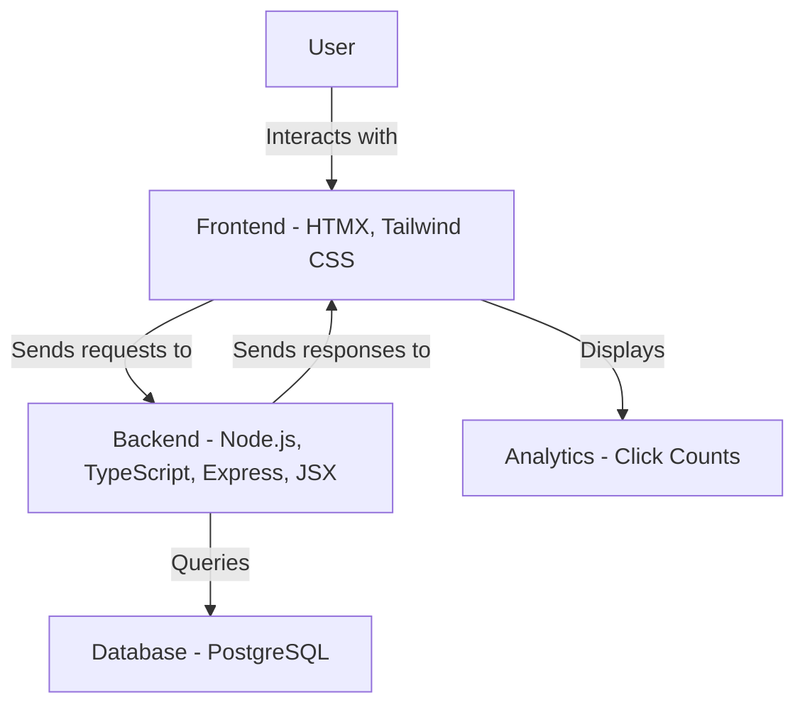

# URL Shortening Service (ju.mp)

## Overview
This project is a web application that allows users to shorten long URLs into short, easy-to-remember links. The service is designed to be user-friendly and visually appealing, providing both regular users and admins with the necessary functionalities.

## Features
- **User Registration and Login**: Users can create accounts and log in to manage their shortened URLs.
- **URL Shortening**: Users can input long URLs and receive a shortened version.
- **Basic Analytics**: Users can view click counts and other basic analytics for their shortened URLs.
- **Custom Short URLs**: Users have the option to create custom short URLs.

## User Roles
- **Regular Users**: Can create and manage their own short URLs.
- **Admins**: Can create short URLs and have visibility into user accounts for oversight.

## Technology Stack
- **Frontend**: HTMX with JSX, TypeScript, Tailwind CSS
- **Backend**: Node.js with Express
- **Database**: PostgreSQL
- **Deployment**: Kubernetes with GitHub Actions for CI/CD

## Development Approach
- **Testing Methodology**: Test Driven Development (TDD)
- **Focus on Testing**: Use of fake services and end-to-end (E2E) testing with ephemeral resources.

## Contributing
Contributions are welcome! Please feel free to submit a pull request or open an issue for any suggestions or improvements.

## License
This project is licensed under the MIT License - see the [LICENSE](LICENSE) file for details.

## Acknowledgments
- Inspired by various URL shortening services.
- Thanks to the open-source community for the tools and libraries used in this project.